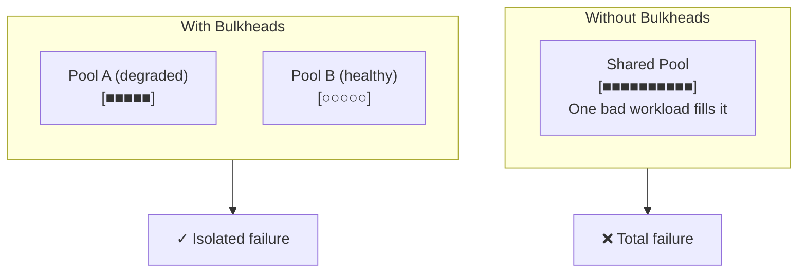

## What problem it solves

Shared pools are a single blast radius: one slow route, one noisy tenant, or one unhealthy dependency can saturate threads/connections and starve everything else.

Bulkheads isolate capacity into separate pools so failures are contained.

- **Containment:** prevents cross-talk between workloads
- **Predictability:** protects high-priority traffic
- **Graceful degradation:** one compartment floods, others stay afloat

## How it works

You create separate limits per class of work: e.g., separate thread pools, separate connection pools, separate queues.

Once a pool is full, requests in that category are rejected or queued without impacting other categories.

- Partition by tenant, endpoint, or dependency
- Set per-pool concurrency limits
- Add priority lanes (gold/silver/bronze)

## Common pitfalls

Too many partitions can waste capacity and complicate ops.

If you partition but still share a deeper dependency, you may only move the bottleneck.

- Over-partitioning (unused capacity in one pool while another is saturated)
- No clear admission strategy when a pool is full
- Ignoring downstream shared bottlenecks

## How this simulator models it

The simulator treats "bulkheads" as separate lanes/pools with different quality. Saturation or higher failure in one lane doesn't fully block the other lane.

In the visualization you can see requests distributed across lanes and how a degraded lane doesn't fully collapse the whole pipeline.

## Diagram

