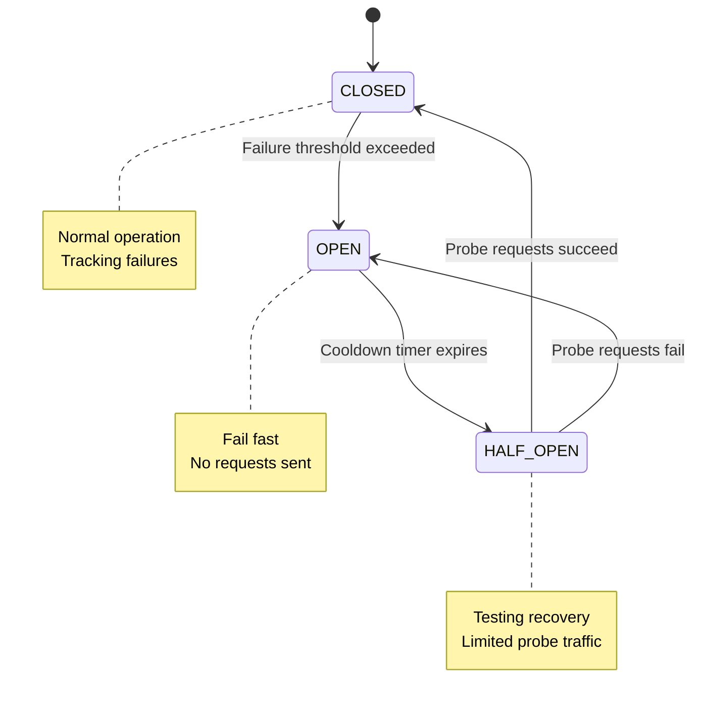

## What problem it solves

When a dependency is slow or unhealthy, continuing to send requests usually makes things worse: queues grow, timeouts increase, and the caller burns resources waiting.

A circuit breaker detects sustained failure and temporarily stops sending traffic to give the dependency time to recover, while protecting the caller.

- Prevents cascades caused by slow failures
- Turns long waits into fast failures
- Creates breathing room for recovery

## How it works (states)

Circuit breakers usually have three states. In **CLOSED**, requests flow normally while failures are tracked. If failures exceed a threshold, it trips **OPEN** and immediately rejects requests. After a cooldown, it moves to **HALF_OPEN** and allows a small number of probe requests.

If probes succeed, it closes; if they fail, it re-opens and cools down again.

- **Threshold:** how many failures trigger OPEN
- **Cooldown:** how long to stay OPEN
- **Probe policy:** how many HALF_OPEN requests and success criteria

## Common pitfalls

If the circuit is too sensitive, it flaps (opens/closes frequently). If it's too insensitive, it trips too late.

Fail-fast is not the same as success: you still need good fallbacks or error handling.

- Using consecutive-failure thresholds without time windows (too spiky)
- No fallback or degraded mode when OPEN
- Probe traffic too high (HALF_OPEN becomes load test)

## How this simulator models it

The breaker watches request outcomes to Service B. After repeated failures it transitions to OPEN and rejects requests immediately. After a cooldown, it transitions to HALF_OPEN and lets some requests through.

In the flow visualization, OPEN means requests stop at the breaker and fail fast (you'll see fewer particles reach Service B).

## Diagram

