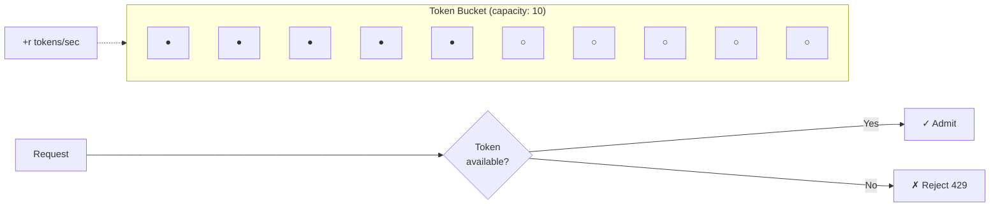

## What problem it solves

Rate limiting protects systems from overload (accidental or malicious) and enforces fairness between clients.

It also smooths bursty traffic so downstream services experience a more stable load profile.

- Prevents overload from spikes
- Enforces per-client or global quotas
- Improves predictability under load

## How token bucket works

Imagine a bucket of tokens. Each request spends one token. Tokens are added back at a fixed rate up to a maximum capacity.

This allows short bursts (spend saved tokens), but enforces a long-term average rate (refill rate).

- **Refill rate** controls sustained throughput
- **Bucket size** controls burst capacity
- **On empty bucket:** reject quickly (typically 429)

## Common pitfalls

Hard rejects can harm UX if clients aren't coded to handle them gracefully.

If you rate-limit only at the edge but not internally, you can still overload internal tiers with fan-out.

- No client guidance (no Retry-After, no backoff)
- Limiting only globally, not per-tenant/client
- Forgetting burst capacity (bucket size) and causing unnecessary rejects

## How this simulator models it

Requests pass through a token bucket. If tokens are available, the request continues; otherwise it is rejected immediately.

In the flow view you'll see rejected requests stop early at the rate limiter, protecting the rest of the pipeline.

## Diagram

