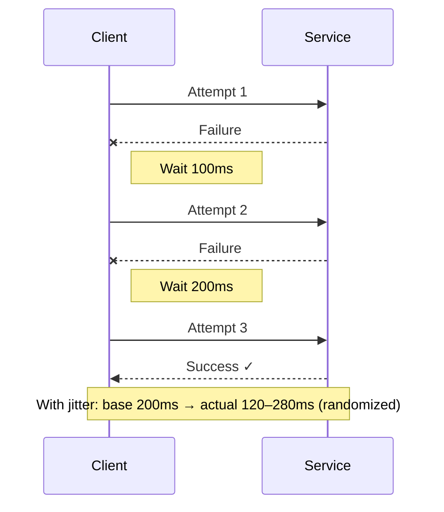

## What problem it solves

Many failures are transient: a brief network glitch, a momentary overload, or a short-lived deployment blip. A retry can turn those into successes without user intervention.

But retries are dangerous: they increase load exactly when a system is already struggling. The retry policy must be conservative and well-scoped.

- **Good for:** timeouts, 503s, connection resets (transient)
- **Bad for:** deterministic failures (4xx), invalid inputs, permanent errors

## How it works (backoff + jitter)

A retry policy usually specifies max attempts and a delay schedule. Backoff increases the delay after each failure so you don't instantly hammer the dependency.

Jitter randomizes retry timing across clients so they don't all retry at once (the thundering herd problem).

- **Fixed delay:** simple but can synchronize clients
- **Exponential backoff:** spreads load more aggressively
- **Jitter:** adds randomness to avoid waves
- **Max attempts:** bounds worst-case latency and load

## Common pitfalls

Unbounded retries can turn a partial outage into a full outage.

Retrying non-idempotent operations can cause duplicates (double charges, double writes).

- No jitter (synchronized retry storms)
- Retrying too quickly (no backoff)
- Retrying everything (including 4xx)
- Not enforcing idempotency for write operations

## How this simulator models it

Failed requests can be re-attempted based on the selected strategy (off / fixed / jitter). Each attempt is visualized as a new traversal through the pipeline.

The model is intentionally focused on the macro-effect: retries improve success rate under transient errors, but increase load and can worsen saturation under sustained failure.

## Diagram

