## What problem it solves

In distributed systems, tail latency and partial failures are normal. A single slow dependency can cause requests to pile up, saturate pools (threads, connections), and then cascade into broader outages.

Timeouts put a hard upper bound on how long you're willing to wait, so the system can fail fast and preserve capacity for other work.

- Limits worst-case latency per hop
- Prevents resource leaks (stuck connections / blocked workers)
- Creates clear signals for circuit breakers and retries

## How it works

A timeout is a deadline. If the operation hasn't finished by the deadline, the caller stops waiting and treats it as a failure.

In well-designed systems, the timeout is paired with cancellation so the downstream work can stop too (when supported).

- Pick timeouts per hop (client → gateway, gateway → service, service → DB)
- Use shorter timeouts closer to the user; enforce end-to-end budgets
- Treat timeouts as first-class failures in metrics

## Common pitfalls

Timeouts that are too long do nothing; timeouts that are too short cause self-inflicted failures.

Timeouts without cancellation can still overload the downstream even if the caller gives up.

- Using a single global timeout for all calls
- Retrying aggressively on timeouts without backoff (creates retry storms)
- Not aligning timeouts across hops (downstream timeout > upstream timeout wastes work)

## How this simulator models it

The simulator assigns each request a deadline. If the simulated latency exceeds that deadline, the request is marked as timed out and counted as a failure.

This is intentionally a simplified model: it focuses on the user-visible effect (bounded waiting) and the knock-on effects on retries and the circuit breaker.

## Diagram

```mermaid
gantt
    title Request Timeline with Timeout
    dateFormat X
    axisFormat %Lms
    
    section Fast Response
    Request Processing :done, 0, 200
    
    section Slow Response
    Request Processing :active, 0, 600
    
    section Timeout Case
    Request Processing :crit, 0, 800
    Timeout Triggered :milestone, 800, 0
```

